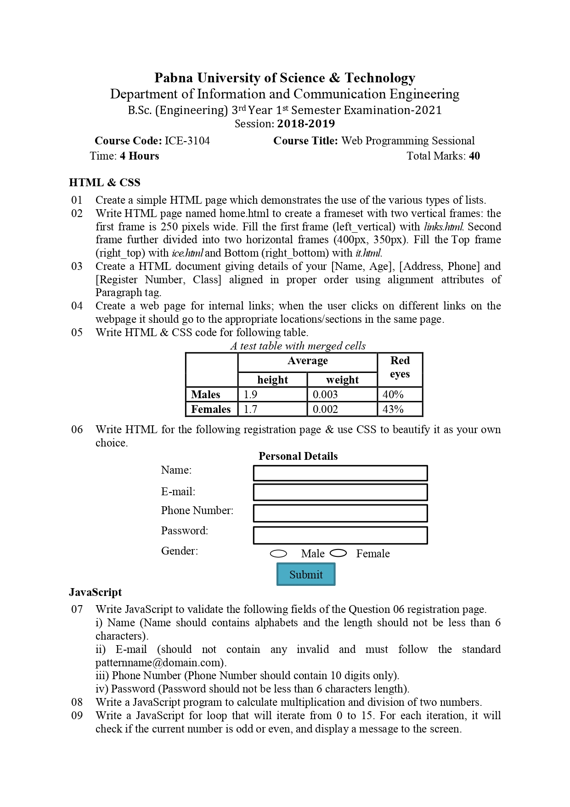
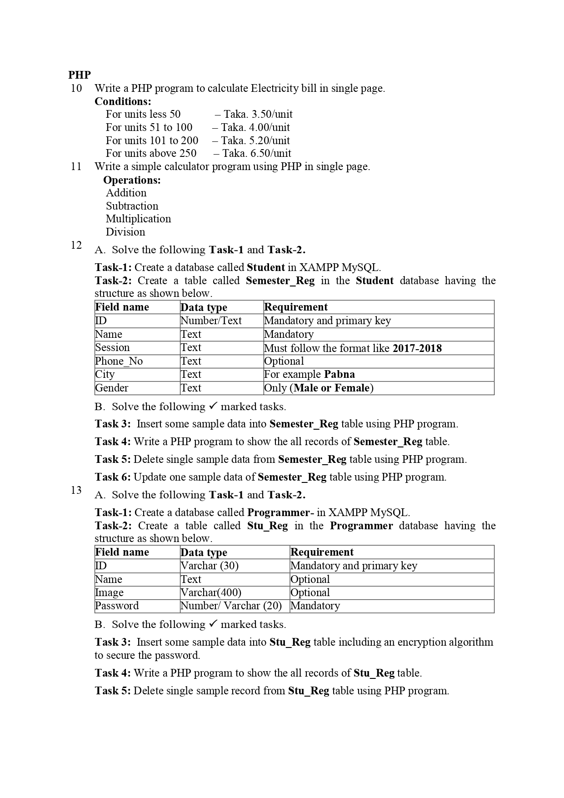
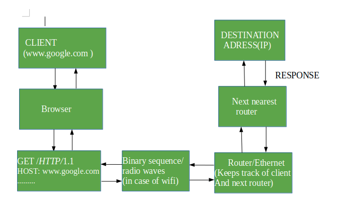

# WEB-PROGRAMMING

[![Youtube][youtube-shield]][youtube-url]
[![Facebook][facebook-shield]][facebook-url]
[![Instagram][instagram-shield]][instagram-url]
[![LinkedIn][linkedin-shield]][linkedin-url]

Thanks for visiting my GitHub account!

 **Web development** is the work involved in developing a website for the Internet or an intranet. Web development can range from developing a simple single static page of plain text to complex web applications, electronic businesses, and social network services. [see-more](https://www.geeksforgeeks.org/internet-and-web-programming/)

## Source Code (Download)

[Click Here]()

## Required Software

- Xampp [Download](https://www.apachefriends.org/download.html)
- Visual Studio Code [Download](https://code.visualstudio.com/download)

## Project Features

|                                |                                |
| :----------------------------: | :----------------------------: |
|           HTML & CSS           |              PHP               |
|  |  |

## Working Principle

|                                         |
| :-------------------------------------: |
|                 Roadmap                 |
|  |

## Key Components of Web Programming

### Client-Side Technologies

#### HTML:

HTML stands for HyperText Markup Language. It is used to design web pages using a markup language. HTML is the combination of Hypertext and Markup language. Hypertext defines the link between the web pages. A markup language is used to define the text document within tag which defines the structure of web pages.

#### CSS :

Cascading Style Sheets is a stylesheet language used to design the webpage to make it attractive. The reason for using CSS is to simplify the process of making web pages presentable. CSS allows you to apply styles to web pages. More importantly, CSS enables you to do this independent of the HTML that makes up each web page.
JavaScript: JavaScript is the most powerful and versatile programming language used in the web. It is a lightweight, cross-platform, single-threaded and interpreted programming language. It is a commonly used programming language to create dynamic and interactive elements in web applications. It is easy to learn, compiled language.

### Server-Side Technologies

#### Server-Side Languages:

Languages like PHP, Python, Ruby, Java, and Node.js are used to handle server-side logic, process requests, and generate dynamic content.

#### Databases:

Systems like MySQL, PostgreSQL, MongoDB, or SQLite are used to store and retrieve data dynamically, enabling web applications to manage and manipulate information.

#### Server Environment:

Software environments such as Apache, Nginx, or Microsoft IIS provide the infrastructure to host and serve web applications. They handle incoming requests, route them to the appropriate handlers, and send responses back to clients.

## Popular Web Programming Frameworks

- **React:** React is a JavaScript toolkit that enables developers to design reusable UI components.
- **Django:** Django is a high-level Python framework for building backend APIs and managing databases.
- **Ruby on Rails:** Ruby on Rails is a popular framework for developing full-stack web applications fast using the - Ruby programming language.
- **Angular:** Angular is a framework for creating complex online applications, including two-way data binding and dependency injection.
- **Laravel:** Laravel is a PHP framework that provides elegant syntax and developer-friendly tools for creating scalable web applications.
- **Express.js:** Express.js is a lightweight Node.js framework for creating server-side applications with customisable routing and middleware features.

## Security Mechanism Used in Internet and Web Programming

- **Encipherment:** This security mechanism deals with hiding and covering of data which helps data to become confidential. It is achieved by applying mathematical algorithms which reconstruct information into not readable form. It is achieved by Cryptography.
- **Access Control:** It can be achieved by various techniques such as applying passwords, using firewall, or just by adding PIN to data.
- **Bit Stuffing:** This security mechanism is used to add some extra bits into data which is being transmitted. It helps data to be checked at the receiving end and is achieved by Even parity or Odd Parity.
- **Digital Signature:** This security mechanism is achieved by adding digital data that is not visible. It is form of electronic signature which is added by sender which is checked by receiver electronically. This mechanism is used to preserve data which is not more confidential but sender’s identity is to be notified.
- **Notarization:** This security mechanism involves use of trusted third party in communication. It acts as intermediate between sender and receiver so that if any chance of conflict is reduced.
- **Authentication:** This is achieved at the TCP/IP layer where 3-way handshaking mechanism is used to ensure data is sent or not.

## For More

- [HTML-Documentation](https://github.com/learnwithfair/html-documentation)
- [CSS-Documentation](https://github.com/learnwithfair/css-documentation)
- [PHP-Documentation](https://github.com/learnwithfair/php-documentation)

## Follow Me

    

<!-- MARKDOWN LINKS & IMAGES -->

[youtube-shield]: https://img.shields.io/badge/-Youtube-black.svg?style=flat-square&logo=youtube&color=555&logoColor=white
[youtube-url]: https://youtube.com/@learnwithfair
[facebook-shield]: https://img.shields.io/badge/-Facebook-black.svg?style=flat-square&logo=facebook&color=555&logoColor=white
[facebook-url]: https://facebook.com/learnwithfair
[instagram-shield]: https://img.shields.io/badge/-Instagram-black.svg?style=flat-square&logo=instagram&color=555&logoColor=white
[instagram-url]: https://instagram.com/learnwithfair
[linkedin-shield]: https://img.shields.io/badge/-LinkedIn-black.svg?style=flat-square&logo=linkedin&colorB=555
[linkedin-url]: https://linkedin.com/company/learnwithfair
